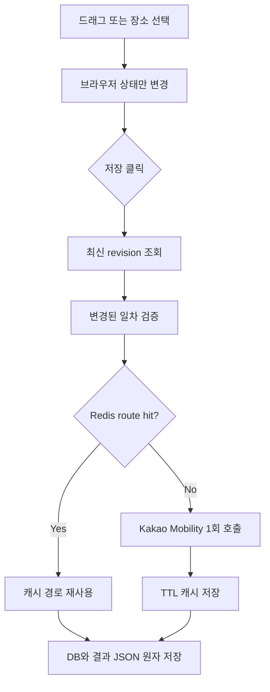

# 일정 편집·Redis 캐시 구현 및 운영 가이드

## 1. 구현 결과

- 기존 일정 화면과 카드 UI는 유지했다.
- 관광지·식당·카페 카드는 같은 일차 안에서 드래그해 순서를 변경할 수 있다.
- 항공편, 공항, 숙소, 렌터카 관련 카드는 고정되어 이동·교체할 수 없다.
- 드래그할 때는 서버 API를 호출하지 않는다. 사용자가 `저장`을 누를 때만 최신 리비전 조회 1회와 저장 1회를 호출한다.
- 저장 시 백엔드는 클라이언트가 보낸 장소명·좌표를 신뢰하지 않고 DB의 `type + placeId`로 장소를 다시 조회한다.
- 변경된 일차만 Kakao Mobility 이동시간과 path를 재계산하고, 항공 탑승 준비·렌터카 반납·셔틀 시간을 침범하면 422로 저장을 거부한다.
- 같은 좌표로 판단되는 5m 이내 구간은 Kakao API를 호출하지 않고 0분 경로로 처리한다.
- Bedrock은 최초 일정 생성에만 사용하며 드래그·장소 변경에는 호출하지 않는다.

## 2. 편집 API

| Method | Path | 용도 |
|---|---|---|
| `GET` | `/api/trips/{tripId}/plan/editor` | 현재 plan, requestId, DB revision 조회 |
| `PUT` | `/api/trips/{tripId}/plan/editor` | 순서·장소 변경을 원자적으로 검증하고 저장 |
| `GET` | `/api/trips/{tripId}/plan/places?type=ATTRACTION&query=한림` | DB 장소 검색(외부 API 호출 없음) |

`PUT`은 `baseRevision`과 `requestId`를 모두 검사한다. 두 브라우저가 같은 일정을 수정하면 먼저 저장된 요청만 성공하고, 늦은 요청은 `409 Conflict`로 최신 일정을 다시 불러오게 한다.

지원 범위는 현재 프로젝트 시나리오와 같은 `AIR + RENTAL_CAR`이다. 자차·KTX·대중교통은 이동시간 규칙과 고정 anchor가 별도로 필요하므로 422로 명확히 거절한다.

## 3. API 호출을 줄인 구조



한 번의 저장 처리 안에서는 `RoutingService`의 요청 단위 snapshot도 사용한다. 같은 구간을 시간 검증과 path 저장 단계에서 다시 필요로 해도 외부 API를 중복 호출하지 않는다.

## 4. Redis에 저장하는 값

Redis는 영구 데이터베이스가 아니라 재생성 가능한 외부 조회 결과 캐시다. 사용자별 완성 일정, JWT, Bedrock 응답은 이 캐시에 넣지 않는다.

| Cache | 기본 TTL | 캐시 키의 의미 |
|---|---:|---|
| `kakaoDrivingRoute` | 15분 | 출발·도착 위경도 기반 차량 경로 |
| `weatherShort` | 2시간 | 좌표와 단기 예보 기준시각 |
| `weatherMid` | 6시간 | 지역과 중기 예보 기준시각 |
| `flightSchedule` | 12시간 | 공항·날짜·편명 조회 조건 |
| `cafeCandidates` | 30분 | 지역·검색 조건별 카페 후보 |
| `tripPlanAttractionCandidates` | 30분 | 일정 생성용 관광지 후보 |
| `tripPlanRestaurantCandidates` | 30분 | 일정 생성용 식당 후보 |
| `tripPlanCafeCandidates` | 30분 | 일정 생성용 카페 후보 |

값은 Java 기본 직렬화가 아니라 캐시별 타입이 정해진 JSON으로 저장한다. 키 prefix는 기본적으로 `travel:{environment}:cache:v3:{cacheName}::` 형태다. 배포 후 DTO 형식이 바뀌면 `CACHE_NAMESPACE`의 버전을 올리는 방식으로 안전하게 전체 캐시를 무효화한다.

## 5. 장애 대응 방식

- Redis 연결 실패 시 요청 자체를 실패시키지 않고 각 Pod의 최대 256개, 최대 60초 로컬 TTL 캐시로 전환한다.
- Redis를 5초마다 무리하게 재접속하지 않도록 짧은 회로 차단 시간을 둔다.
- 로컬 캐시는 LRU 방식으로 상한을 유지해 메모리 무제한 증가를 막는다.
- Redis와 로컬 캐시 모두 miss일 때만 원래 외부 API를 실행한다.
- 외부 경로 API까지 실패하면 항공 시간 안전성을 추정값으로 저장하지 않고 503으로 저장을 취소한다.

이 fallback은 가용성을 위한 것이며 Pod 간 캐시 일관성을 보장하지 않는다. 캐시 값은 짧은 TTL의 조회 결과이므로 이 트레이드오프를 허용했다.

## 6. 로컬 실행

Redis만 실행한다.

```powershell
docker compose up -d redis
docker compose ps
docker exec travel-redis redis-cli ping
```

백엔드 `.env` 예시:

```dotenv
CACHE_PROVIDER=redis
CACHE_NAMESPACE=travel:local:cache:v3
REDIS_HOST=localhost
REDIS_PORT=6379
REDIS_DATABASE=0
REDIS_SSL_ENABLED=false
CACHE_ROUTE_TTL=15m
CACHE_CANDIDATE_TTL=30m
```

Redis 없이 개발하려면 `CACHE_PROVIDER=simple`로 두면 된다. 이때도 bounded local cache가 동작한다.

## 7. EKS·ElastiCache 설정

`k8s/configmap.yaml`의 다음 값은 실제 환경에 맞춰 관리한다.

```yaml
CACHE_PROVIDER: "redis"
CACHE_NAMESPACE: "travel:prod:cache:v3"
REDIS_HOST: "<ElastiCache primary endpoint>"
REDIS_PORT: "6379"
REDIS_SSL_ENABLED: "false"
```

인증 토큰을 사용하는 Redis라면 `REDIS_PASSWORD`는 ConfigMap이 아니라 Kubernetes Secret에 넣는다. ElastiCache 보안 그룹은 EKS worker/node 또는 Pod 보안 그룹에서 6379 접근만 허용한다.

적용 및 확인:

```powershell
kubectl apply -f .\k8s\configmap.yaml
kubectl rollout restart deployment/travel-api deployment/travel-worker -n travel
kubectl rollout status deployment/travel-api -n travel
kubectl rollout status deployment/travel-worker -n travel
kubectl exec deployment/travel-api -n travel -- printenv CACHE_PROVIDER
kubectl exec deployment/travel-api -n travel -- printenv REDIS_HOST
```

VPC 내부에서 키와 TTL을 확인하는 예시:

```powershell
kubectl run redis-cli -n travel --rm -it --restart=Never --image=redis:7-alpine -- sh
redis-cli -h <ElastiCache-endpoint> -p 6379 --scan --pattern 'travel:prod:cache:v3:*'
redis-cli -h <ElastiCache-endpoint> -p 6379 TTL '<key>'
```

운영 중 `KEYS *`는 사용하지 않는다. 구현의 cache clear도 blocking `KEYS` 대신 `SCAN`을 사용한다.

## 8. 관측 지표

Micrometer에 다음 counter를 등록했다.

- `travel.cache.requests{cache,result=hit|miss}`
- `travel.cache.loads{cache}`
- `travel.cache.errors{cache}`

캐시 적중률은 다음처럼 설명할 수 있다.

`hit ratio = hit / (hit + miss)`

적중률만 높이는 것이 목표는 아니다. 날씨·항공처럼 변경 가능성이 있는 데이터는 TTL을 과도하게 늘리지 않고, Kakao 경로는 15분으로 짧게 유지해 비용 절감과 최신성의 균형을 잡았다.

## 9. 발표용 핵심 설명

> 드래그앤드롭은 즉시 반응하는 로컬 UI로 구현하고 저장 시점에만 서버 검증을 수행했습니다. 서버는 클라이언트 좌표를 신뢰하지 않고 DB ID로 장소를 복원한 뒤, 항공·렌터카 제약을 포함해 실제 Kakao 이동시간으로 변경된 날짜만 다시 계산합니다. 외부 API 결과는 Redis cache-aside 구조로 재사용하며, Redis 장애 시에도 bounded local cache로 기능을 유지합니다.

예상 질문:

1. **왜 완성 일정을 Redis에 저장하지 않았나?**  
   완성 일정은 사용자 데이터이며 수정 충돌과 영속성이 중요하므로 MariaDB와 generation result JSON이 기준이다. Redis에는 없어져도 다시 구할 수 있는 외부 조회 결과만 저장했다.

2. **왜 드래그할 때 바로 API를 호출하지 않았나?**  
   사용자가 여러 번 순서를 바꿀 수 있어 호출 폭증과 느린 UI가 발생한다. 저장 시 한 번에 검증하면 호출 수와 경쟁 상태를 함께 줄일 수 있다.

3. **Redis가 죽으면 일정 생성도 멈추나?**  
   아니다. 5초 단위 재시도 억제와 Pod 로컬 TTL 캐시로 우회하며, 캐시 miss이면 원래 API를 호출한다.

4. **캐시 데이터가 오래되면 어떻게 하나?**  
   도메인별 TTL을 분리했고 스키마 변경 시 namespace 버전을 올린다. 항공·날씨 데이터에는 관광 후보보다 도메인에 맞는 TTL을 사용한다.

5. **동시 편집은 어떻게 막나?**  
   trip row pessimistic lock과 generation optimistic version을 함께 사용한다. 오래된 화면의 저장 요청은 409로 거절한다.

6. **왜 현재 항공+렌터카만 편집 가능한가?**  
   KTX·대중교통·자차는 환승, 운행시간, 주차 같은 제약 모델이 다르다. 검증 없이 범위를 넓히지 않고 현재 보장 가능한 시나리오만 명시적으로 지원했다.

## 10. 검증 명령

```powershell
# 백엔드: JDK 21 필요
.\gradlew.bat clean test jacocoTestReport
.\gradlew.bat build

# 프론트
npm ci
node --test tests/*.test.mjs tests/*.test.cjs
npm run build
```

프론트는 편집 payload 테스트를 포함한다. 백엔드는 캐시 상한과 편집 정책 테스트를 포함한다. CI의 SonarQube Quality Gate 통과 여부는 저장소의 실제 gate 조건과 전체 JaCoCo 결과로 최종 판단해야 하며, 특정 기능 구현만으로 80% 전체 커버리지를 보장한다고 단정할 수 없다.
